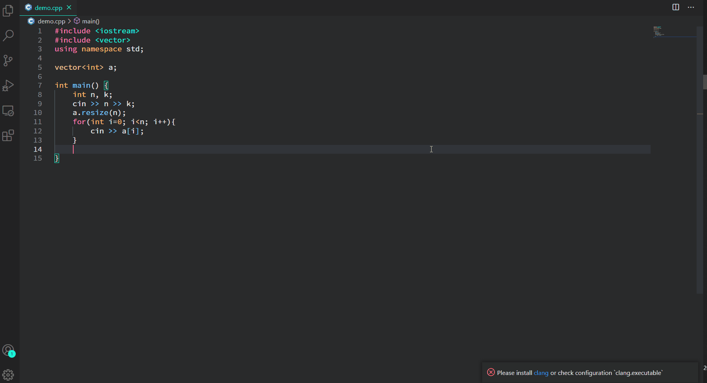

# Code-Search README

## 何ができるのか(Features)

`Code-Search`は、ブラウザで検索することなく、vscode内でコード実装の疑問を検索することができます。
(`Code-Search` allows you to search for code implementation questions in vscode without having to search in a browser.)

検索ワードに関連するページから抽出されたコードを表示します。(Displays the code extracted from pages related to the search word.)

現在は日本語技術情報共有サービスである[Qiita](https://qiita.com/)と日本語ブログサービスである[Hatena Blog](https://hatenablog.com/)のみに対応しています。(Currently, only [Qiita](https://qiita.com/), a Japanese technical information sharing service, and [Hatena Blog](https://hatenablog.com/), a Japanese blog service, are supported.)

## 使い方(Usage)

`code-search.search`というコマンドを実行し、入力ボックスに検索ワードを入れてください。(Execute the command `code-search.search`, put your search words in the input box and enter.)

